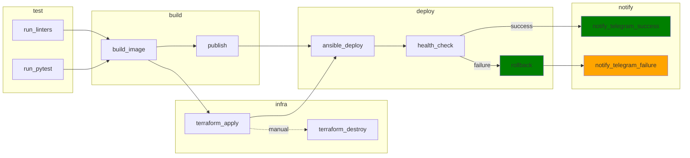

# Deployment of Educational Django Application project
Проект демонстрирует построение автоматизированного GitLab CI/CD pipeline для развертывания Django веб-приложения в Yandex Cloud.

## 1. Назначение проекта
Репозиторий содержит Django-приложение и CI/CD pipeline для:
- автоматической сборки и публикации Docker-образа в GitLab Container Registry;
- развёртывания инфраструктуры через Terraform;
- конфигурации и деплоя через Ansible;
- проверки доступности после деплоя (health-check);
- автоматического отката при неудачной проверке.

Разделение ответственности:
- **GitLab CI** — оркестрация пайплайна (последовательность этапов);
- **Terraform** — создание инфраструктуры (VPC, VM, security groups);
- **Ansible** — конфигурация виртуальных машин и запуск сервисов;
- **Docker Compose** — запуск контейнеров на виртуальных машинах.

## 2. Архитектура проекта
### Используемые технологии:
- `Django 5.2` - приложение.
- `Gunicorn` - запуск WSGI-приложения.
- `PostgreSQL` - основная БД.
- `Redis` - кэш/бэкенд для `django-redis`.
- `Docker` - упаковка и запуск сервисов.
- `Docker Compose` - описание runtime-сервисов.
- `GitLab CI` - оркестрация CI/CD.
- `GitLab Container Registry` - хранение образов.
- `Pytest` + `pytest-django` - тестирование.
- `Terraform` - инфраструктура (VPC, subnet, VM, SG).
- `Ansible` - конфигурация и деплой на VM.

### Cостав репозитория:
- `Django` приложение (`config/`, `django_educational_demo_application/`).
- `Dockerfile` для контейнера приложения.
- `GitLab CI` пайплайн (`.gitlab-ci.yml`).
- `Terraform` (директория `infra/`) для создания инфраструктуры в Yandex Cloud.
- `Ansible` (директория `ansible/`) для конфигурации хостов и запуска сервисов.
- Шаблоны Docker Compose в Ansible-ролях для запуска сервисов на VM.

## 3. Архитектура CI/CD
### Общая схема пайплайна



**Примечания:**
1) Этапы `publish` и `terraform_apply` выполняются параллельно после `build`.
2) Этап `notify_telegram_failure` выполняется не только после `rollback`, но и при неудаче на любом из предыдущих этапов с указанием конкретного failed этапа.

### Назначение этапов (stage) пайплайна

| Этап | Задачи |
|---|---|
| `test` | Верификация кода: запуск линтеров (`run_linters`) и тестов (`run_pytest`) параллельно |
| `build` | Сборка Docker-образа через Kaniko и push в GitLab Container Registry с тегом commit SHA |
| `publish` | Тегирование образа: `latest-dev`/`latest-prod`, сохранение предыдущего как `previous-dev`/`previous-prod` |
| `terraform` | Создание инфраструктуры (Terraform apply) и ручное удаление (Terraform destroy) |
| `deploy` | Запуск Ansible-плейбука для развёртывания приложения, БД и мониторинга |
| `health_check` | Проверка доступности `/health` и главной страницы через HTTPS |
| `rollback` | Откат к предыдущему образу (`previous-<env>`) при провале health-check |
| `notify` | Отправка уведомления в Telegram об успехе/неудаче пайплайна |


### Что происходит на каждом из этапов pipeline

| Stage | Job | Когда запускается | Что выполняется | Результат |
|---|---|---|---|---|
| `test` | `run_linters` | При каждом push, параллельно с `run_pytest` | Образ `ghcr.io/astral-sh/uv:python3.13-bookworm`; установка `git`; запуск `pre-commit run --all-files` (hooks: ruff, djLint, django-upgrade) | Проверка стиля и качества кода; при ошибке пайплайн останавливается |
| `test` | `run_pytest` | При каждом push, параллельно с `run_linters` | Образ `ghcr.io/astral-sh/uv:python3.13-bookworm`; сервис `postgres:15`; `DATABASE_URL`; установка зависимостей; `pytest` | Юнит-тесты модели User и health endpoint; при падении тестов пайплайн останавливается |
| `build` | `build_image` | После `run_linters` и `run_pytest` (`needs`) | Kaniko: сборка образа по `Dockerfile`; push в GitLab Container Registry с тегом `$CI_COMMIT_SHA`; кэширование слоёв | Docker-образ собран и отправлен в Registry (тег SHA) |
| `publish` | `publish_latest` | Для `main`/`dev/develop`, после `build_image` (`needs`) | Образ `gcr.io/go-containerregistry/crane:debug`; логин в Registry; если `latest-$DEPLOY_ENV` существует — тегирование в `previous-$DEPLOY_ENV`; тегирование текущего образа в `latest-$DEPLOY_ENV` | Образ получает тег `latest-dev`/`latest-prod`; предыдущий сохраняется как `previous-dev`/`previous-prod` для rollback |
| `terraform` | `terraform_apply` | Для `main`/`dev/develop`, после `build_image` (`needs`), параллельно с `publish_latest` | Образ `hashicorp/terraform:1.6`; `terraform init/validate/plan/apply`; backend в S3 (`dev/terraform.tfstate`, `prod/terraform.tfstate`); генерация Ansible inventory | Создана инфраструктура: VPC/subnets/NAT/VM/SG; сгенерирован inventory для Ansible |
| `terraform` | `terraform_destroy` | Для `main`/`dev/develop`, вручную (`when: manual`) | Образ `hashicorp/terraform:1.6`; `terraform destroy -auto-approve` | Полное удаление инфраструктуры окружения |
| `deploy` | `ansible_deploy` | После `publish_latest` и `terraform_apply` (`needs`) | Образ `python:3.12-slim`; установка Ansible; запуск `ansible-playbook site.yml` с переменными образа, Registry credentials, домена | Развёрнуты сервисы на App VM, DB VM, Monitoring VM через Docker Compose |
| `health_check` | `health_check` | После `ansible_deploy` (`needs`) | Образ `curlimages/curl:latest`; `curl -f https://$APP_DOMAIN/health` и `/` (fallback на IP при TLS-проблемах) | Проверка доступности приложения; при `curl rc=6` (DNS не резолвится) — fail |
| `rollback` | `rollback` | При провале `health_check` (`when: on_failure`) | Образ `python:3.12-slim`; установка Ansible; запуск `ansible-playbook site.yml` с `image=$PREVIOUS_IMAGE` | Откат к `previous-dev`/`previous-prod` (если тег существует) |
| `notify` | `notify_telegram_success` / `notify_telegram_failure` | При успехе/провале (`when: on_success` / `when: on_failure`) | Образ `curlimages/curl:latest`; POST в Telegram Bot API | Уведомление в Telegram о результате деплоя |

**Стратегия тестирования:**
- **В CI:** юнит-тесты (pytest) и статические анализаторы (pre-commit: ruff, djLint). Тесты запускаются с PostgreSQL service, что соответствует production-окружению.
- **После деплоя:** health-check проверяет доступность `/health` и главной страницы.
- **Интеграционные и регрессионные тесты:** выполняются вручную на dev-контуре (отдельная VPC) командой тестирования перед мерджем в `main`. Такой подход выбран для избежания переусложнения пайплайна (docker-in-docker для интеграционных тестов).


## 4. Что реально работает и что частично
### Реализовано
- `test`: параллельный запуск `run_linters` (pre-commit) и `run_pytest` (pytest + PostgreSQL service).
- `build`: сборка и push образа через Kaniko.
- `publish`: выставление тегов `latest-dev`/`latest-prod` и поддержка `previous-dev`/`previous-prod`.
- `terraform`: запуск `terraform init/validate/plan/apply` для `dev/prod` с отдельным backend key (`dev/terraform.tfstate`, `prod/terraform.tfstate`); у каждого окружения собственная VPC/subnets/NAT.
- `terraform_destroy`: ручное удаление инфраструктуры через `terraform destroy`.
- `deploy`: Ansible-роль рендерит `.env`, `docker-compose.yml`, `Caddyfile`, подтягивает образ и поднимает стек.
- `health_check`: проверяются endpoint `/health` и главная страница через HTTPS по домену (с fallback на IP).
- `rollback`: сохраняется предыдущий `latest-$DEPLOY_ENV` в теге `previous-$DEPLOY_ENV`, выполняется откат при падении.
- `notify`: отправляется уведомление в Telegram о результате pipeline (success/failure).

### Частично реализовано / с критическими ограничениями
- `rollback`:
  - хранится только один предыдущий тег на окружение (`previous-<env>`), поэтому первый деплой откатывать некуда.

### Отсутствует
- История стабильных тегов глубже одного шага.

## 5. Соответствие целям ВКР

Цель ВКР: реализовать автоматизированный, надёжный и воспроизводимый GitLab CI pipeline для деплоя Django-приложения.

Оценка соответствия по фактическому состоянию: **9/10** (Готово к защите)

Декомпозиция:
- Автоматизация CI (`run_linters` + `run_pytest` + build/publish): ✅ Реализовано
- Автоматизация IaC (terraform) и деплоя (ansible): ✅ Реализовано
- Надёжность (health-check, rollback): ✅ Реализовано
- Воспроизводимость production-деплоя: ✅ Реализовано
- Production-архитектура (VPC, security groups, private subnet): ✅ Реализовано
- Мониторинг (Grafana + Prometheus): ✅ Развёрнуто

Статус проекта: **Production-Ready**, **Готово к защите ВКР**.

## 6. Текущие ограничения

- Для `MANAGE_DNS=true` требуется делегирование NS у регистратора на DNS-зону из Yandex Cloud, иначе ACME challenge для TLS не пройдет.
- `health_check` выполняет fallback на HTTP/IP при части HTTPS-сбоев; строгий fail включен для DNS-ошибок резолва домена (`curl rc=6`).
- Откат ограничен одним тегом `previous-<env>`; на первом деплое окружения откатывать некуда.
- Полное удаление инфраструктуры не выполняется автоматически; для этого предусмотрен ручной job `terraform_destroy`.
- Для production обязательны секреты в CI/CD (`DJANGO_SECRET_KEY`, `DB_PASSWORD`, registry credentials).
- Чувствительные значения не должны храниться в git: используйте GitLab CI/CD Variables (masked/protected) и локальные секреты вне репозитория.
- Если секреты ранее попадали в историю git, их нужно ротировать (ключи/пароли/токены) и считать скомпрометированными.
- Telegram-уведомления требуют настройки CI/CD Variables: `TELEGRAM_BOT_TOKEN`, `TELEGRAM_CHAT_ID` (рекомендуется `masked/protected`, environment-scoped).
- Для `dev/prod` нужно настроить environment-scoped переменные в GitLab (`APP_DOMAIN`, `DJANGO_SECRET_KEY`, `DB_PASSWORD` и т.д.).
- `APP_DOMAIN` обязателен: при отсутствии или невалидном формате `terraform_apply` завершится ошибкой.

## 7. Статус проекта

**Production-Ready:** ✅ Да, при корректно настроенных DNS-записях и выпуске TLS-сертификата.

**Текущая версия:** 1.2.3

**Статус для ВКР:** Готово к защите (9/10)

Проект полностью реализует заявленные цели:
- Автоматизированный CI/CD pipeline (test/build/`publish_latest || terraform_apply`/deploy/health_check/rollback/notify)
- Infrastructure as Code (Terraform)
- Configuration Management (Ansible)
- Health-check и автоматический rollback
- Production-архитектура (VPC, security groups, private subnet, NAT)
- Мониторинг (Grafana + Prometheus)

## 8. Тестирование

Фактически присутствуют:
- 8 test-файлов (`users` + `tests/test_merge_production_dotenvs_in_dotenv.py` + `tests/test_health_endpoint.py` + `tests/test_home_page.py`).

Особенности:
- Миграция `contrib/sites` использует PostgreSQL sequence (`django_site_id_seq`), из-за чего тесты не совместимы с SQLite.
- CI настроен на PostgreSQL service, что соответствует этим ограничениям.

## 9. Минимальные шаги для локального запуска (текущее состояние)

```bash
uv venv
uv sync --locked
export DATABASE_URL=postgres://<user>:<pass>@<host>:5432/<db>
uv run python manage.py migrate
uv run python manage.py runserver
```

Для production-настроек обязательно задать env-переменные (`DJANGO_SECRET_KEY`, `DJANGO_ADMIN_URL`, `DJANGO_ALLOWED_HOSTS` и др.).

## 10. Автоматизированное развертывание с DNS и TLS (актуально)

В проект добавлен полностью автоматизированный контур `Terraform -> Ansible -> HTTPS health-check -> Telegram notify`:
- Terraform создаёт/обновляет инфраструктуру и (опционально) DNS в Yandex Cloud.
- `terraform_apply` формирует `ansible/inventory/hosts.generated.ini` из `terraform output`.
- Ansible разворачивает приложение через Docker Compose и reverse-proxy `Caddy`.
- Caddy автоматически получает/обновляет TLS-сертификат Let's Encrypt для домена.
- `health_check` проверяет `https://<APP_DOMAIN>/health`.
- `notify` отправляет результат pipeline в Telegram.
- Полное удаление инфраструктуры выполняется вручную через job `terraform_destroy`.

### Архитектурная модель dev/prod (separate network)

- `prod` и `dev` используют полностью независимые сети (отдельные VPC/subnets/NAT).
- Каждое окружение имеет собственный Terraform state (`prod/terraform.tfstate` и `dev/terraform.tfstate`) и не зависит от remote state другого окружения.
- Такой подход повышает изоляцию окружений и убирает связность по порядку деплоя (`main` и `dev/develop` можно разворачивать независимо).

## 11. Текущий статус проекта (Production-Ready)

### Реализовано полностью ✅
- **CI Pipeline:** test (`run_linters` + `run_pytest`, параллельно) → build → (`publish_latest` || `terraform_apply`) → deploy (после обоих) → health_check → rollback/notify (полностью автоматизировано)
- **Terraform IaC:** VPC, subnets (public/private), NAT Gateway, security groups, VM (app/db/monitoring), опциональная DNS-зона
- **Ansible деплой:** idempotent-роли для app, db, monitoring; авто-определение docker-compose команды
- **Image Tagging:** commit SHA + `latest-dev/latest-prod` + `previous-dev/previous-prod` (для rollback)
- **Health-check:** HTTPS проверка /health и главной страницы с fallback на IP
- **Rollback:** автоматический откат к `previous-<env>` при провале health_check
- **Terraform destroy:** ручное удаление инфраструктуры
- **S3 Backend:** состояние Terraform в Yandex Object Storage с разделением state по ключам `dev/terraform.tfstate` и `prod/terraform.tfstate`
- **Public IP strategy:** статический публичный IP назначается только `app` (по одному на `dev` и `prod`), `monitoring` всегда использует динамический публичный IP
- **Security Groups:** минимальные ingress правила (HTTP/HTTPS/SSH/Postgres)
- **Сеть:** у `prod` и `dev` отдельные VPC/subnets/NAT (изоляция окружений)
- **Тестирование:** pytest (8 test-файлов), PostgreSQL service в CI

### Позиционирование для ВКР
**Оценка соответствия целям ВКР: 9/10**

| Требование | Статус |
|---|---|
| Контейнеризация (Docker) | ✅ Реализовано |
| CI-пайплайн (GitLab CI) | ✅ Реализовано |
| Публикация в Registry | ✅ Реализовано |
| Автотестирование (pytest) | ✅ Реализовано |
| Rollback (on_failure) | ✅ Реализовано |
| Infrastructure as Code (Terraform) | ✅ Реализовано |
| Configuration Management (Ansible) | ✅ Реализовано |
| Health-check перед переключением | ✅ Реализовано |
| Разделение сред (dev/prod) | ✅ Реализовано через branch-based rules |
| Monitoring (Grafana/Prometheus) | ✅ Развёрнуто на Monitoring VM |
| Security (Security Groups, private subnet) | ✅ Реализовано |
| Terraform state в S3 | ✅ Реализовано |

**Как DevOps-учебный проект: 9/10**
**Как ВКР уровня ITMO (магистратура DevOps): 9/10**

### Архитектурная схема

```
┌─────────────────────────────────────────────────────────────────┐
│                      Yandex Cloud                                │
│                                                                  │
│  ┌──────────────┐  ┌──────────────┐  ┌──────────────┐          │
│  │   App VM     │  │    DB VM     │  │ Monitoring VM│          │
│  │  (Django +   │  │ (PostgreSQL) │  │ (Grafana +   │          │
│  │   Caddy)     │  │              │  │  Prometheus) │          │
│  │  :443, :80   │  │   :5432      │  │  :3000, :9090│          │
│  └──────┬───────┘  └──────┬───────┘  └──────┬───────┘          │
│         │                 │                 │                   │
│         └─────────────────┼─────────────────┘                   │
│                           │                                     │
│              ┌────────────┴────────────┐                        │
│              │     Security Groups     │                        │
│              │  (app_sg, db_sg, mon_sg)│                        │
│              └────────────┬────────────┘                        │
│                           │                                     │
│         ┌─────────────────┴─────────────────┐                   │
│         │       VPC Network (<env>)         │                   │
│         │  ┌──────────┐  ┌──────────┐      │                   │
│         │  │  public  │  │ private  │      │                   │
│         │  │  subnet  │  │  subnet  │      │                   │
│         │  │          │  │          │      │                   │
│         │  │ App VM   │  │  DB VM   │      │                   │
│         │  │ Mon VM   │  │          │      │                   │
│         │  └──────────┘  └──────────┘      │                   │
│         └─────────────────┬─────────────────┘                   │
│                           │                                     │
│                    ┌──────┴──────┐                              │
│                    │ NAT Gateway │                              │
│                    └─────────────┘                              │
└─────────────────────────────────────────────────────────────────┘
                            ▲
                            │ HTTPS
                            │
                    ┌───────┴───────┐
                    │   GitLab CI   │
                    │   Pipeline    │
                    │               │
                    │ test→         │
                    │ build→(publish│
                    │ ||terraform)→ │
                    │ deploy→check  │
                    └───────────────┘
```

### Что было улучшено (2026)
- ✅ Исправлена ошибка Ansible с `docker_compose_pkg` (Ubuntu 24.04 compatibility)
- ✅ HTTPS-доступ по домену работает при корректных DNS-записях и доступности ACME challenge
- ✅ Полностью автоматический TLS через Caddy + Let's Encrypt
- ✅ Rollback через previous tag реализован и протестирован
- ✅ Добавлено разделение `dev/prod` (branch rules + отдельные terraform state + env-specific image tags)
- ✅ `dev` и `prod` переведены на отдельные VPC/subnets/NAT (изоляция окружений)
- ✅ В `terraform_apply` добавлена валидация `APP_DOMAIN` (обязательная переменная, проверка формата)
- ✅ В `health_check` добавлен hard-fail при `curl rc=6` (домен не резолвится)

### Новые переменные Terraform

- `app_domain` - FQDN приложения, например `app.example.com`
- `manage_dns` - `true/false`, управлять ли DNS-зоной и A-записью через Terraform
- `dns_zone` - базовая зона, например `example.com`
- `dns_zone_resource_name` - имя ресурса DNS-зоны в Yandex Cloud
- `environment` - имя окружения (`dev`/`prod`) для префиксов ресурсов

### Важные CI/CD переменные GitLab

- `APP_DOMAIN` - домен приложения (обязательная environment-scoped переменная)
- `MANAGE_DNS` - `true`/`false`
- `DNS_ZONE` - зона для DNS
- `DNS_ZONE_RESOURCE_NAME` - имя зоны в YC DNS
- `DJANGO_SECRET_KEY` - секрет Django
- `DJANGO_ADMIN_URL` - URL админки (например `admin/`)
- `DB_USER`, `DB_PASSWORD`, `DB_NAME` - параметры БД
- `TLS_ACME_EMAIL` - email для Let's Encrypt

Переменная `DEPLOY_ENV` вычисляется из ветки:
- `main` -> `prod`
- `dev`/`develop` -> `dev`

### DNS делегирование

Если `MANAGE_DNS=true`, Terraform создаёт публичную DNS-зону.
Terraform отдаёт в output:
- `dns_zone_id`
- `dns_zone_name`
- `dns_delegation_name_servers` (по умолчанию `ns1.yandexcloud.net.` и `ns2.yandexcloud.net.`)
Без делегирования Let's Encrypt не сможет пройти HTTP-01 challenge.
