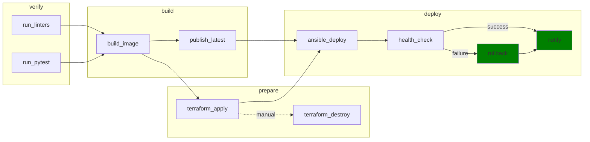

# Deployment of Educational Django Application

Автоматизированный GitLab CI/CD pipeline для развертывания Django-приложений в Yandex Cloud.

## О приложении
**Django Educational Demo Application** — демонстрационное веб-приложение для управления образовательными проектами и курсами.
Позволяет преподавателям создавать и управлять курсами, отслеживать прогресс работы над проектами, а студентам выполнять и сдавать задания.
### Основной функционал:
- **Курсы и зачисления** — создание учебных курсов, управление списками студентов
- **Проекты** — создание проектов со статусами (draft → in_progress → review → completed), ссылками на репозитории и развёрнутые приложения
- **Задачи** — разбиение проектов на подзадачи
- **Оценивание** — выставление оценок преподавателем, отслеживание средней оценки студента
- **Статистика** — аналитика по курсам (количество студентов, проектов, средняя оценка)
- **Аутентификация** — регистрация/вход через социальные сети (django-allauth)

## О пайплайне

CI/CD pipeline обеспечивает:
- автоматическую сборку и публикацию Docker-образов в GitLab Container Registry;
- развёртывание инфраструктуры через Terraform (VPC, VM, security groups);
- конфигурацию серверов и деплой через Ansible;
- health-check развернутого приложения;
- автоматический откат при неудачной проверке;
- уведомления в Telegram о результатах деплоя.

## Технологии

| Категория | Инструменты |
|---|---|
| Application | Django 5.2, Gunicorn, PostgreSQL, Redis |
| CI/CD | GitLab CI, GitLab Container Registry, Kaniko |
| Containerization | Docker, Docker Compose |
| IaC | Terraform (Yandex Cloud provider) |
| Configuration | Ansible |
| Testing | pytest, pytest-django, pre-commit (ruff, djLint) |
| Monitoring | Grafana, Prometheus |

## Структура репозитория

```
├── .gitlab-ci.yml          # GitLab CI/CD pipeline
├── Dockerfile              # Образ приложения
├── infra/                  # Terraform-модули для Yandex Cloud
├── ansible/                # Ansible-роли и плейбуки
├── config/                 # Django settings
├── django_educational_demo_application/  # Django app
└── tests/                  # Тесты
```

## Архитектура CI/CD

### Схема пайплайна



> **Для наглядности диаграмма упрощена**:
> - `publish_latest` и `terraform_apply` выполняются параллельно после `build_image`
> - `ansible_deploy` требует артефакты от `terraform_apply` и `publish_latest`
> - `notify_telegram_success` запускается `on_success` - когда не осталось pending/failed jobs (не только после `health_check`)
> - `notify_telegram_failure` запускается на `on_failure` при любой ошибке (не только после `rollback`)


### Этапы пайплайна

| Stage | Job                       | Описание                                                                     |
|---|---------------------------|------------------------------------------------------------------------------|
| `verify` | `run_linters`             | pre-commit hooks (ruff, djLint, django-upgrade)                              |
| `verify` | `run_pytest`              | pytest с PostgreSQL service                                                  |
| `build` | `build_image`             | Kaniko: сборка и push с тегом `$CI_COMMIT_SHA`                               |
| `build` | `publish_latest`          | Тегирование `latest-dev`/`latest-prod` и `previous-dev`/`previous-prod`      |
| `prepare` | `terraform_apply`         | Создание инфраструктуры в Yandex Cloud                                       |
| `prepare` | `terraform_destroy`       | Ручное удаление инфраструктуры                                               |
| `deploy` | `ansible_deploy`          | Деплой через Ansible + Docker Compose                                        |
| `deploy` | `health_check`            | Проверка HTTPS `/health` и `/`                                               |
| `deploy` | `rollback`                | Откат к `previous-<env>` при провале health_check                            |
| `deploy` | `notify_telegram_success` | Уведомления в Telegram об успехе деплоя                                      |
| `deploy` | `notify_telegram_failure` | Уведомления в Telegram об ошибке пайплайна с указанием конкретной failed job |

**Правила запуска:**
- Ветки `main` → окружение `prod`, `dev`/`develop` → окружение `dev`
- `terraform_destroy` запускается вручную
- `rollback` и `notify_telegram_failure` запускаются при ошибке


## Реализованный функционал

### Полностью реализовано ✅

- **CI Pipeline:** verify → build → (publish || prepare) → deploy → notify
- **Terraform IaC:** VPC, subnets (public/private), NAT Gateway, security groups, VM (app/db/monitoring), опциональная DNS-зона
- **Ansible деплой:** idempotent-роли для app, db, monitoring; авто-определение docker-compose команды
- **Image Tagging:** commit SHA + `latest-dev/latest-prod` + `previous-dev/previous-prod` (для rollback)
- **Health-check:** HTTPS проверка `/health` и главной страницы с fallback на IP
- **Rollback:** автоматический откат к `previous-<env>` при провале health_check
- **Terraform destroy:** ручное удаление инфраструктуры
- **S3 Backend:** состояние Terraform в Yandex Object Storage (`dev/terraform.tfstate`, `prod/terraform.tfstate`)
- **Изоляция окружений:** отдельные VPC/subnets/NAT для dev и prod

### Ограничения ⚠️

- **Rollback:** хранится только один предыдущий тег (`previous-<env>`); первый деплой откатывать некуда
- **DNS:** при `MANAGE_DNS=true` требуется делегирование NS на регистраторе для ACME challenge
- **Health-check:** fallback на HTTP/IP при некоторых HTTPS-сбоях; strict-fail только для DNS-ошибок (`curl rc=6`)
- **Секреты:** требуют настройки в GitLab CI/CD Variables (masked/protected)

## Тестирование

**9 тест-файлов:**
- `django_educational_demo_application/users/tests/` (5 файлов: admin, forms, models, urls, views)
- `tests/test_health_endpoint.py`
- `tests/test_home_page.py`
- `tests/test_merge_production_dotenvs_in_dotenv.py`

**Особенности:**
- Тесты используют PostgreSQL (не совместимы с SQLite из-за sequence в миграциях `contrib/sites`)
- CI запускает pytest с PostgreSQL service

## Локальный запуск

```bash
uv venv
uv sync --locked
export DATABASE_URL=postgres://<user>:<pass>@<host>:5432/<db>
uv run python manage.py migrate
uv run python manage.py runserver
```

Production-переменные: `DJANGO_SECRET_KEY`, `DJANGO_ADMIN_URL`, `DJANGO_ALLOWED_HOSTS` и др.

## Архитектура инфраструктуры

```
┌─────────────────────────────────────────────────────────────────┐
│                      Yandex Cloud                                │
│                                                                  │
│  ┌──────────────┐  ┌──────────────┐  ┌──────────────┐          │
│  │   App VM     │  │    DB VM     │  │ Monitoring VM│          │
│  │  (Django +   │  │ (PostgreSQL) │  │ (Grafana +   │          │
│  │   Caddy)     │  │              │  │  Prometheus) │          │
│  │  :443, :80   │  │   :5432      │  │  :3000, :9090│          │
│  └──────┬───────┘  └──────┬───────┘  └──────┬───────┘          │
│         │                 │                 │                   │
│         └─────────────────┼─────────────────┘                   │
│                           │                                     │
│              ┌────────────┴────────────┐                        │
│              │     Security Groups     │                        │
│              │  (app_sg, db_sg, mon_sg)│                        │
│              └────────────┬────────────┘                        │
│                           │                                     │
│         ┌─────────────────┴─────────────────┐                   │
│         │       VPC Network (<env>)         │                   │
│         │  ┌──────────┐  ┌──────────┐      │                   │
│         │  │  public  │  │ private  │      │                   │
│         │  │  subnet  │  │  subnet  │      │                   │
│         │  │          │  │          │      │                   │
│         │  │ App VM   │  │  DB VM   │      │                   │
│         │  │ Mon VM   │  │          │      │                   │
│         │  └──────────┘  └──────────┘      │                   │
│         └─────────────────┬─────────────────┘                   │
│                           │                                     │
│                    ┌──────┴──────┐                              │
│                    │ NAT Gateway │                              │
│                    └─────────────┘                              │
└─────────────────────────────────────────────────────────────────┘
                            ▲
                            │ HTTPS
                            │
                    ┌───────┴───────┐
                    │   GitLab CI   │
                    │   Pipeline    │
                    │               │
                    │ verify→       │
                    │ build→(publish│
                    │ ||prepare)→   │
                    │ deploy→notify │
                    └───────────────┘
```

## Конфигурация

### Переменные Terraform

| Переменная | Описание | Пример |
|---|---|---|
| `app_domain` | FQDN приложения | `app.example.com` |
| `manage_dns` | Управлять DNS-зоной через Terraform | `true`/`false` |
| `dns_zone` | Базовая DNS-зона | `example.com` |
| `dns_zone_resource_name` | Имя ресурса DNS-зоны | `diploma-zone-dev` |
| `environment` | Имя окружения | `dev`/`prod` |

### Переменные GitLab CI/CD

| Переменная | Описание | Scope |
|---|---|---|
| `APP_DOMAIN` | Домен приложения (обязательная) | environment |
| `MANAGE_DNS` | Управление DNS (`true`/`false`) | environment |
| `DNS_ZONE` | DNS-зона | environment |
| `DNS_ZONE_RESOURCE_NAME` | Имя зоны в YC DNS | environment |
| `DJANGO_SECRET_KEY` | Секрет Django | environment, masked |
| `DJANGO_ADMIN_URL` | URL админки | environment |
| `DB_USER`, `DB_PASSWORD`, `DB_NAME` | Параметры БД | environment, masked |
| `TLS_ACME_EMAIL` | Email для Let's Encrypt | environment |
| `TELEGRAM_BOT_TOKEN`, `TELEGRAM_CHAT_ID` | Уведомления | masked |
| `YC_SERVICE_ACCOUNT_KEY` | Ключ сервисного аккаунта | masked |
| `SSH_PUBLIC_KEY`, `SSH_PRIVATE_KEY` | SSH ключи | masked |
| `YC_STORAGE_ACCESS_KEY`, `YC_STORAGE_SECRET_KEY` | S3 backend | masked |

**Определение окружения в зависимости от Git branch:**
- `main` → `prod`
- `dev`/`develop` → `dev`

### DNS делегирование

При `MANAGE_DNS=true` Terraform создаёт публичную DNS-зону и выводит:
- `dns_zone_id`
- `dns_zone_name`
- `dns_delegation_name_servers` (NS-серверы)

Требуется делегирование NS у регистратора для работы ACME challenge (Let's Encrypt).
