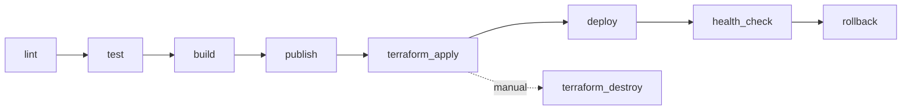
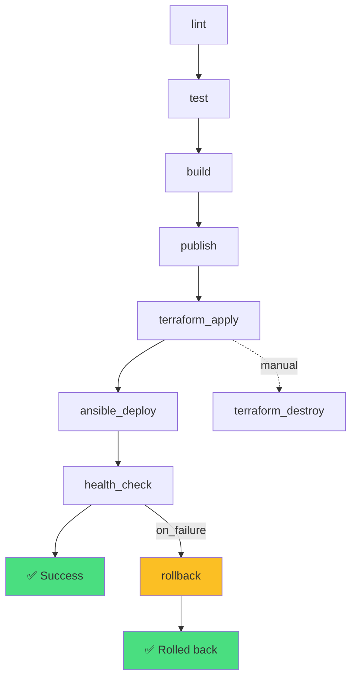

# Deployment of Educational Django Application project
This is a demo project that demonstrates the use of Django, Docker, and GitLab CI/CD for a simple web application deployment.

## 1. Назначение проекта

Репозиторий содержит Django-приложение и CI/CD-обвязку для:
- сборки и публикации Docker-образа в GitLab Container Registry;
- развёртывания через Terraform + Ansible;
- базовой проверки доступности после деплоя;
- попытки отката при неуспешной проверке.

Разделение ответственности:
- GitLab CI: оркестрация
- Terraform: создание инфраструктуры
- Ansible: конфигурация и доставка
- Docker Compose: запуск сервисов на App VM и Monitoring VM

## 2. Архитектура проекта
### Используемые технологии:
- `Django 5.2` - приложение.
- `Gunicorn` - запуск WSGI-приложения.
- `PostgreSQL` - основная БД.
- `Redis` - кэш/бэкенд для `django-redis`.
- `Docker` - упаковка и запуск сервисов.
- `Docker Compose` - описание runtime-сервисов.
- `GitLab CI` - оркестрация CI/CD.
- `GitLab Container Registry` - хранение образов.
- `Pytest` + `pytest-django` - тестирование.
- `Terraform` - инфраструктура (VPC, subnet, VM, SG).
- `Ansible` - конфигурация и деплой на VM.

### Cостав репозитория:
- `Django` приложение (`config/`, `django_educational_demo_application/`).
- `Dockerfile` для контейнера приложения.
- `GitLab CI` пайплайн (`.gitlab-ci.yml`).
- `Terraform` (директория `infra/`) для создания инфраструктуры в Yandex Cloud.
- `Ansible` (директория `ansible/`) для конфигурации хостов и запуска сервисов.
- Шаблоны Docker Compose в Ansible-ролях для запуска сервисов на VM.


## 3. Архитектура CI/CD
### Общая схема пайплайна:


### Назначение этапов (stage) пайплайна:
- `lint` - запуск pre-commit-hooks, django-upgrade, ruff, djLint
- `test` - запуск pytest
- `build` - сборка Docker-образа приложения и push в Container Registry с тегом commit SHA
- `publish` - публикация тегированного образа в GitLab Container Registry
- `terraform` - создание инфраструктуры для деплоя (Terraform apply) и ручное удаление (Terraform destroy)
- `deploy` - запуск Ansible-плейбука для деплоя приложения, БД и мониторинга
- `health_check` - проверка `/health` и главной страницы у задеплоенного приложения
- `rollback` - в случае провала `health_check` осуществляет откат к предыдущему образу из Container Registry


### Что происходит на каждом из этапов pipeline

| Stage | Job | Когда запускается                                            | Что выполняется | Результат |
|---|---|--------------------------------------------------------------|---|---|
| `lint` | `linter_check` | При каждом push в репозиторий                                | Образ `python:3.13-slim`; установка `git`, `build-essential`, `libpq-dev`, `uv`; `uv venv`; `uv sync --locked`; `uv run pre-commit run --show-diff-on-failure --color=always --all-files` | Проверка качества кода, при ошибке пайплайн останавливается |
| `test` | `test_pytest` | После `lint`                                                 | Образ `ghcr.io/astral-sh/uv:python3.13-bookworm`; сервис `postgres:15`; настройка `DATABASE_URL`; установка `build-essential`, `libpq-dev`; `uv sync --locked`; `uv run pytest` | Проверка корректности тестами, при падении тестов дальнейшие стадии не запускаются |
| `build` | `build_image` | После `test`                                                 | Сборка через Kaniko: создание `/kaniko/.docker/config.json`; запуск `/kaniko/executor` с `--context "$CI_PROJECT_DIR"`, `--dockerfile "$CI_PROJECT_DIR/Dockerfile"`, `--destination "$CI_REGISTRY_IMAGE:$CI_COMMIT_SHA"` (`IMAGE_TAG`), `--cache=true` | Docker-образ собирается и сразу пушится в GitLab Container Registry с тегом коммита |
| `publish` | `publish_latest` | Для `main` (prod) и `dev/develop` (dev), после `build_image` (`needs`) | Образ `gcr.io/go-containerregistry/crane:debug`; `crane auth login` в `$CI_REGISTRY`; если `latest-$DEPLOY_ENV` существует — `crane tag ... previous-$DEPLOY_ENV`, затем `crane tag $IMAGE_TAG latest-$DEPLOY_ENV` | Образ с тегом коммита получает `latest-dev`/`latest-prod`, предыдущий хранится как `previous-dev`/`previous-prod` |
| `terraform` | `terraform_destroy` | Для `main` (prod) и `dev/develop` (dev), вручную (`when: manual`) | Образ `hashicorp/terraform:1.6`; переход в `infra`; `terraform init` с backend key `${DEPLOY_ENV}/terraform.tfstate`; `terraform destroy -auto-approve` | Полное удаление инфраструктуры по выбранному окружению |
| `terraform` | `terraform_apply` | Для `main` (prod) и `dev/develop` (dev) | Образ `hashicorp/terraform:1.6`; переход в `infra`; `terraform init` с backend key `${DEPLOY_ENV}/terraform.tfstate`; `terraform validate`; `terraform plan -out=tfplan`; `terraform apply -auto-approve tfplan`; сохранение артефактов | Инфраструктура создается/обновляется независимо для `dev` и `prod` |
| `deploy` | `ansible_deploy` | Для `main` (prod) и `dev/develop` (dev), после `terraform_apply` (`needs`) | Образ `python:3.12-slim`; `pip install ansible`; переход в `ansible`; `ansible-playbook site.yml` с `--extra-vars`: `image=$IMAGE_TAG`, `registry_url=$CI_REGISTRY`, `registry_user=$CI_REGISTRY_USER`, `registry_password=$CI_REGISTRY_PASSWORD` | Попытка развернуть приложение и сопутствующие сервисы на подготовленной инфраструктуре |
| `health_check` | `health_check` | Для `main` (prod) и `dev/develop` (dev), после `ansible_deploy` (`needs`) | Образ `curlimages/curl:latest`; проверки `curl -f https://$APP_DOMAIN/health` и `curl -f https://$APP_DOMAIN/` (с fallback на IP) | Подтверждение доступности приложения по HTTPS-домену, при неуспехе стадия падает |
| `rollback` | `rollback` | Для `main` (prod) и `dev/develop` (dev), `when: on_failure` | Образ `python:3.12-slim`; установка `ansible`; переход в `ansible`; запуск `ansible-playbook site.yml` с `image=$PREVIOUS_IMAGE` и параметрами `registry_url`, `registry_user`, `registry_password` | Попытка отката на `previous-dev`/`previous-prod` (если тег существует) |


## 4. Что реально работает и что частично
### Реализовано
- `lint`: запуск `pre-commit` в CI.
- `test`: запуск `pytest` в CI с сервисом `postgres:15`.
- `build`: сборка и push образа через Kaniko.
- `publish`: выставление тегов `latest-dev`/`latest-prod` и поддержка `previous-dev`/`previous-prod`.
- `terraform`: запуск `terraform init/validate/plan/apply` для `dev/prod` с отдельным backend key (`dev/terraform.tfstate`, `prod/terraform.tfstate`).
- `terraform_destroy`: ручное удаление инфраструктуры через `terraform destroy`.
- `deploy`: Ansible-роль рендерит `.env`, `docker-compose.yml`, `Caddyfile`, подтягивает образ и поднимает стек.
- `health_check`: проверяются endpoint `/health` и главная страница через HTTPS по домену (с fallback на IP).
- `rollback`: сохраняется предыдущий `latest-$DEPLOY_ENV` в теге `previous-$DEPLOY_ENV`, выполняется откат при падении.

### Частично реализовано / с критическими ограничениями
- `rollback`:
  - хранится только один предыдущий тег на окружение (`previous-<env>`), поэтому первый деплой откатывать некуда.

### Отсутствует
- Стадия/механизм `notify` (Slack/Telegram/email/webhook уведомления из CI не реализованы).
- История стабильных тегов глубже одного шага.

## 5. Соответствие целям ВКР

Цель ВКР: реализовать автоматизированный, надёжный и воспроизводимый GitLab CI pipeline для деплоя Django-приложения.

Оценка соответствия по фактическому состоянию: **9/10** (Готово к защите)

Декомпозиция:
- Автоматизация CI (lint/test/build/publish): ✅ Реализовано
- Автоматизация IaC (terraform) и деплоя (ansible): ✅ Реализовано
- Надёжность (health-check, rollback): ✅ Реализовано
- Воспроизводимость production-деплоя: ✅ Реализовано
- Production-архитектура (VPC, security groups, private subnet): ✅ Реализовано
- Мониторинг (Grafana + Prometheus): ✅ Развёрнуто

Статус проекта: **Production-Ready**, **Готово к защите ВКР**.

## 6. Текущие ограничения

- Для `MANAGE_DNS=true` требуется делегирование NS у регистратора на DNS-зону из Yandex Cloud, иначе ACME challenge для TLS не пройдет.
- Откат ограничен одним тегом `previous-<env>`; на первом деплое окружения откатывать некуда.
- Полное удаление инфраструктуры не выполняется автоматически; для этого предусмотрен ручной job `terraform_destroy`.
- Для production обязательны секреты в CI/CD (`DJANGO_SECRET_KEY`, `DB_PASSWORD`, registry credentials).
- Чувствительные значения не должны храниться в git: используйте GitLab CI/CD Variables (masked/protected) и локальные секреты вне репозитория.
- Если секреты ранее попадали в историю git, их нужно ротировать (ключи/пароли/токены) и считать скомпрометированными.
- В репозитории отсутствуют CI-уведомления (`notify`), webhooks как часть пайплайна не настроены.
- Для `dev/prod` нужно настроить environment-scoped переменные в GitLab (`APP_DOMAIN`, `DJANGO_SECRET_KEY`, `DB_PASSWORD` и т.д.), иначе окружения будут использовать fallback-значения.

## 7. Статус проекта

**Production-Ready:** ✅ Да, приложение работает и доступно по HTTPS.

**Текущая версия:** 1.2.3

**Статус для ВКР:** Готово к защите (9/10)

Проект полностью реализует заявленные цели:
- Автоматизированный CI/CD pipeline (lint/test/build/publish/deploy)
- Infrastructure as Code (Terraform)
- Configuration Management (Ansible)
- Health-check и автоматический rollback
- Production-архитектура (VPC, security groups, private subnet, NAT)
- Мониторинг (Grafana + Prometheus)

## 8. Тестирование

Фактически присутствуют:
- 7 test-файлов (`users` + `tests/test_merge_production_dotenvs_in_dotenv.py` + `tests/test_health_endpoint.py`).

Особенности:
- Миграция `contrib/sites` использует PostgreSQL sequence (`django_site_id_seq`), из-за чего тесты не совместимы с SQLite.
- CI настроен на PostgreSQL service, что соответствует этим ограничениям.

## 9. Минимальные шаги для локального запуска (текущее состояние)

```bash
uv venv
uv sync --locked
export DATABASE_URL=postgres://<user>:<pass>@<host>:5432/<db>
uv run python manage.py migrate
uv run python manage.py runserver
```

Для production-настроек обязательно задать env-переменные (`DJANGO_SECRET_KEY`, `DJANGO_ADMIN_URL`, `DJANGO_ALLOWED_HOSTS` и др.).

## 10. Автоматизированное развертывание с DNS и TLS (актуально)

В проект добавлен полностью автоматизированный контур `Terraform -> Ansible -> HTTPS health-check`:
- Terraform создаёт/обновляет инфраструктуру и (опционально) DNS в Yandex Cloud.
- `terraform_apply` формирует `ansible/inventory/hosts.generated.ini` из `terraform output`.
- Ansible разворачивает приложение через Docker Compose и reverse-proxy `Caddy`.
- Caddy автоматически получает/обновляет TLS-сертификат Let's Encrypt для домена.
- `health_check` проверяет `https://<APP_DOMAIN>/health`.
- Полное удаление инфраструктуры выполняется вручную через job `terraform_destroy`.

## 11. Текущий статус проекта (Production-Ready)

### Реализовано полностью ✅
- **CI Pipeline:** lint → test → build → publish (полностью автоматизировано)
- **Terraform IaC:** VPC, subnets (public/private), NAT Gateway, security groups, VM (app/db/monitoring), DNS-зона
- **Ansible деплой:** idempotent-роли для app, db, monitoring; авто-определение docker-compose команды
- **Image Tagging:** commit SHA + `latest-dev/latest-prod` + `previous-dev/previous-prod` (для rollback)
- **Health-check:** HTTPS проверка /health и главной страницы с fallback на IP
- **Rollback:** автоматический откат к `previous-<env>` при провале health_check
- **Terraform destroy:** ручное удаление инфраструктуры
- **S3 Backend:** состояние Terraform в Yandex Object Storage с разделением state по ключам `dev/terraform.tfstate` и `prod/terraform.tfstate`
- **Security Groups:** минимальные ingress правила (HTTP/HTTPS/SSH/Postgres)
- **Сеть:** разделение на public/private subnet, NAT Gateway для private subnet
- **Тестирование:** pytest (7 test-файлов), PostgreSQL service в CI

### Позиционирование для ВКР
**Оценка соответствия целям ВКР: 9/10**

| Требование | Статус |
|---|---|
| Контейнеризация (Docker) | ✅ Реализовано |
| CI-пайплайн (GitLab CI) | ✅ Реализовано |
| Публикация в Registry | ✅ Реализовано |
| Автотестирование (pytest) | ✅ Реализовано |
| Rollback (on_failure) | ✅ Реализовано |
| Infrastructure as Code (Terraform) | ✅ Реализовано |
| Configuration Management (Ansible) | ✅ Реализовано |
| Health-check перед переключением | ✅ Реализовано |
| Разделение сред (dev/prod) | ✅ Реализовано через branch-based rules |
| Monitoring (Grafana/Prometheus) | ✅ Развёрнуто на Monitoring VM |
| Security (Security Groups, private subnet) | ✅ Реализовано |
| Terraform state в S3 | ✅ Реализовано |

**Как DevOps-учебный проект: 9/10**
**Как ВКР уровня ITMO (магистратура DevOps): 9/10**

### Архитектурная схема

```
┌─────────────────────────────────────────────────────────────────┐
│                      Yandex Cloud                                │
│                                                                  │
│  ┌──────────────┐  ┌──────────────┐  ┌──────────────┐          │
│  │   App VM     │  │    DB VM     │  │ Monitoring VM│          │
│  │  (Django +   │  │ (PostgreSQL) │  │ (Grafana +   │          │
│  │   Caddy)     │  │              │  │  Prometheus) │          │
│  │  :443, :80   │  │   :5432      │  │  :3000, :9090│          │
│  └──────┬───────┘  └──────┬───────┘  └──────┬───────┘          │
│         │                 │                 │                   │
│         └─────────────────┼─────────────────┘                   │
│                           │                                     │
│              ┌────────────┴────────────┐                        │
│              │     Security Groups     │                        │
│              │  (app_sg, db_sg, mon_sg)│                        │
│              └────────────┬────────────┘                        │
│                           │                                     │
│         ┌─────────────────┴─────────────────┐                   │
│         │       VPC Network (<env>)         │                   │
│         │  ┌──────────┐  ┌──────────┐      │                   │
│         │  │  public  │  │ private  │      │                   │
│         │  │  subnet  │  │  subnet  │      │                   │
│         │  │          │  │          │      │                   │
│         │  │ App VM   │  │  DB VM   │      │                   │
│         │  │ Mon VM   │  │          │      │                   │
│         │  └──────────┘  └──────────┘      │                   │
│         └─────────────────┬─────────────────┘                   │
│                           │                                     │
│                    ┌──────┴──────┐                              │
│                    │ NAT Gateway │                              │
│                    └─────────────┘                              │
└─────────────────────────────────────────────────────────────────┘
                            ▲
                            │ HTTPS
                            │
                    ┌───────┴───────┐
                    │   GitLab CI   │
                    │   Pipeline    │
                    │               │
                    │ lint→test→    │
                    │ build→publish │
                    │ →terraform→   │
                    │ deploy→check  │
                    └───────────────┘
```

### Pipeline Diagram



### Что было улучшено (2026)
- ✅ Исправлена ошибка Ansible с `docker_compose_pkg` (Ubuntu 24.04 compatibility)
- ✅ Приложение доступно по HTTPS: **https://app.dedapp.ru**
- ✅ Полностью автоматический TLS через Caddy + Let's Encrypt
- ✅ Rollback через previous tag реализован и протестирован
- ✅ Добавлено разделение `dev/prod` (branch rules + отдельные terraform state + env-specific image tags)

### Новые переменные Terraform

- `app_domain` - FQDN приложения, например `app.example.com`
- `manage_dns` - `true/false`, управлять ли DNS-зоной и A-записью через Terraform
- `dns_zone` - базовая зона, например `example.com`
- `dns_zone_resource_name` - имя ресурса DNS-зоны в Yandex Cloud
- `environment` - имя окружения (`dev`/`prod`) для префиксов ресурсов

### Важные CI/CD переменные GitLab

- `APP_DOMAIN` - домен приложения
- `MANAGE_DNS` - `true`/`false`
- `DNS_ZONE` - зона для DNS
- `DNS_ZONE_RESOURCE_NAME` - имя зоны в YC DNS
- `DJANGO_SECRET_KEY` - секрет Django
- `DJANGO_ADMIN_URL` - URL админки (например `admin/`)
- `DB_USER`, `DB_PASSWORD`, `DB_NAME` - параметры БД
- `TLS_ACME_EMAIL` - email для Let's Encrypt

Переменная `DEPLOY_ENV` вычисляется из ветки:
- `main` -> `prod`
- `dev`/`develop` -> `dev`

### DNS делегирование

Если `MANAGE_DNS=true`, Terraform создаёт публичную DNS-зону.
Terraform отдаёт в output:
- `dns_zone_id`
- `dns_zone_name`
- `dns_delegation_name_servers` (по умолчанию `ns1.yandexcloud.net.` и `ns2.yandexcloud.net.`)
Без делегирования Let's Encrypt не сможет пройти HTTP-01 challenge.
