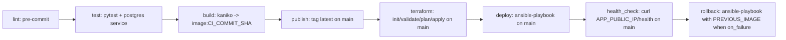

# Deployment of Educational Django Application project
This is a demo project that demonstrates the use of Django, Docker, and GitLab CI/CD for a simple web application deployment.

## 1. Назначение проекта

Репозиторий содержит Django-приложение и CI/CD-обвязку для:
- сборки и публикации Docker-образа в GitLab Container Registry;
- развёртывания через Terraform + Ansible;
- базовой проверки доступности после деплоя;
- попытки отката при неуспешной проверке.

Разделение ответственности:
- GitLab CI: оркестрация
- Terraform: создание инфраструктуры
- Ansible: конфигурация и доставка
- Docker Compose: запуск сервисов на App VM и Monitoring VM

## 2. Архитектура проекта

### Используемые технологии:
- `Django 5.2` - приложение.
- `Gunicorn` - запуск WSGI-приложения.
- `PostgreSQL` - основная БД.
- `Redis` - кэш/бэкенд для `django-redis`.
- `Docker` - упаковка и запуск сервисов.
- `Docker Compose` - описание runtime-сервисов.
- `GitLab CI` - оркестрация CI/CD.
- `GitLab Container Registry` - хранение образов.
- `Pytest` + `pytest-django` - тестирование.
- `Terraform` - инфраструктура (VPC, subnet, VM, SG).
- `Ansible` - конфигурация и деплой на VM.

### Cостав репозитория:
- `Django` приложение (`config/`, `django_educational_demo_application/`).
- `Dockerfile` для контейнера приложения.
- `GitLab CI` пайплайн (`.gitlab-ci.yml`).
- `Terraform` (директория `infra/`) для создания инфраструктуры в Yandex Cloud.
- `Ansible` (директория `ansible/`) для конфигурации хостов и запуска сервисов.
- `docker-compose.prod.yml` как runtime-конфигурация сервисов.


## 3. Архитектура CI/CD
### Общая схема пайплайна:

### Назначение этапов (stage) пайплайна:
- `lint` - запуск pre-commit-hooks, django-upgrade, ruff, djLint
- `test` - запуск pytest
- `build` - сборка Docker-образа приложения и push в Container Registry с тегом commit SHA
- `publish` - публикация тегированного образа в GitLab Container Registry
- `terraform` - создание инфраструктуры для деплоя с Terraform apply
- `deploy` - запуск Ansible-плейбука для деплоя приложения, БД и мониторинга
- `health_check` - проверка ручки health у задеплоенного приложения 
- `rollback` - в случае провала `health_check` осуществляет откат к предыдущему образу из Container Registry

Важно:
- В репозитории есть `docker-compose.prod.yml`, но фактический деплой в CI выполняется через Ansible (`ansible-playbook site.yml`), а не через этот файл напрямую.
- Внутри Ansible есть структурные дефекты ролей (см. раздел ограничений), поэтому реальная воспроизводимость деплоя ограничена.
Что происходит на стадии Build (фактически)

### Что происходит на каждом из этапов pipeline

| Stage | Job | Когда запускается | Что выполняется | Результат |
|---|---|---|---|---|
| `lint` | `linter_check` | Для pipeline коммита | Образ `python:3.13-slim`; установка `git`, `build-essential`, `libpq-dev`, `uv`; `uv venv`; `uv sync --locked`; `uv run pre-commit run --show-diff-on-failure --color=always --all-files` | Проверка качества кода, при ошибке пайплайн останавливается |
| `test` | `test_pytest` | После `lint` | Образ `ghcr.io/astral-sh/uv:python3.13-bookworm`; сервис `postgres:15`; настройка `DATABASE_URL`; установка `build-essential`, `libpq-dev`; `uv sync --locked`; `uv run pytest` | Проверка корректности тестами, при падении тестов дальнейшие стадии не запускаются |
| `build` | `build_image` | После `test` | Сборка через Kaniko: создание `/kaniko/.docker/config.json`; запуск `/kaniko/executor` с `--context "$CI_PROJECT_DIR"`, `--dockerfile "$CI_PROJECT_DIR/Dockerfile"`, `--destination "$CI_REGISTRY_IMAGE:$CI_COMMIT_SHA"` (`IMAGE_TAG`), `--cache=true` | Docker-образ собирается и сразу пушится в GitLab Container Registry с тегом коммита |
| `publish` | `publish_latest` | Только `main`, после `build_image` (`needs`) | Образ `gcr.io/go-containerregistry/crane:debug`; `crane auth login` в `$CI_REGISTRY`; `crane tag $IMAGE_TAG latest` | Образ с тегом коммита получает тег `latest` |
| `terraform` | `terraform_apply` | Только `main` | Образ `hashicorp/terraform:1.6`; переход в `infra`; `terraform init`; `terraform validate`; `terraform plan -out=tfplan`; `terraform apply -auto-approve tfplan`; сохранение артефакта `infra/terraform.tfstate` | Инфраструктура создается или обновляется по Terraform |
| `deploy` | `ansible_deploy` | Только `main`, после `terraform_apply` (`needs`) | Образ `python:3.12-slim`; `pip install ansible`; переход в `ansible`; `ansible-playbook site.yml` с `--extra-vars`: `image=$IMAGE_TAG`, `registry_url=$CI_REGISTRY`, `registry_user=$CI_REGISTRY_USER`, `registry_password=$CI_REGISTRY_PASSWORD` | Попытка развернуть приложение и сопутствующие сервисы на подготовленной инфраструктуре |
| `health_check` | `health_check` | Только `main`, после `ansible_deploy` (`needs`) | Образ `curlimages/curl:latest`; вывод `Running health_check test...`; проверка `curl -f http://$APP_PUBLIC_IP/health` | Подтверждение доступности приложения, при неуспехе стадия падает |
| `rollback` | `rollback` | Только `main`, `when: on_failure` (после провала предыдущих стадий) | Образ `python:3.12-slim`; установка `ansible`; переход в `ansible`; запуск `ansible-playbook site.yml` с `image=$PREVIOUS_IMAGE` и параметрами `registry_url`, `registry_user`, `registry_password` | Попытка отката на предыдущий стабильный образ |

Что выполняется внутри `Dockerfile` на этапе build image:
- базовый образ `python:3.13-slim`
- установка системных пакетов `build-essential` и `libpq-dev`
- копирование `pyproject.toml` и `uv.lock`
- установка `uv`, экспорт зависимостей в `requirements.txt`, установка Python-зависимостей
- копирование исходного кода проекта
- сборка Django-статики:
  - `python manage.py collectstatic --noinput`
  - `python manage.py compress --force`
- добавление `entrypoint.sh` и установка `ENTRYPOINT`

## 4. Что реально работает и что частично

### Реализовано
- `lint`: запуск `pre-commit` в CI.
- `test`: запуск `pytest` в CI с сервисом `postgres:15`.
- `build`: сборка и push образа через Kaniko.
- `publish`: выставление тега `latest` для `main`.
- `terraform`: запуск `terraform init/validate/plan/apply` для `main`.

### Частично реализовано / с критическими ограничениями
- `deploy`:
  - CI-джоб есть, но Ansible-структура неполная.
  - В `roles/app/tasks/main.yml` присутствуют только 3 задачи (установка Docker и логин в registry).
  - Шаги реального запуска контейнера ошибочно находятся в шаблоне `roles/app/templates/docker-compose.yml.j2` и не выполняются как задачи.
- `health_check`:
  - Проверяется `http://$APP_PUBLIC_IP/health`.
  - В Django URLConf endpoint `/health` отсутствует.
- `rollback`:
  - Джоб объявлен.
  - Использует переменную `$PREVIOUS_IMAGE`, которая в репозитории не задаётся.
  - Вызывает тот же playbook, который уже имеет проблемы с ролями.

### Отсутствует
- Отдельные deploy-контуры `dev/prod`.
- Стадия/механизм `notify` (Slack/Telegram/email/webhook уведомления из CI не реализованы).
- Явный механизм фиксации и вычисления предыдущего стабильного тега для отката.

## 5. Соответствие целям ВКР

Цель ВКР: реализовать автоматизированный, надёжный и воспроизводимый GitLab CI pipeline для деплоя Django-приложения.

Оценка соответствия по фактическому состоянию: **55%**.

Декомпозиция:
- Автоматизация CI (lint/test/build/publish): реализовано.
- Автоматизация IaC (terraform) и деплоя (ansible): реализовано частично.
- Надёжность (health-check, rollback): заявлено, но реализовано неполно.
- Воспроизводимость production-деплоя: ограничена из-за дефектов Ansible и отсутствия завершённой rollback-цепочки.

Статус проекта: **MVP / в разработке**, **не production-ready**.

## 6. Текущие ограничения

- `ansible/roles/db/main.yml` расположен вне `tasks/main.yml`, поэтому роль `db` фактически пустая для исполнения ролей Ansible.
- У роли `monitoring` отсутствует `tasks/main.yml`.
- `ansible/roles/common/tasks/main.yml` фактически пустой.
- `ansible/roles/app/templates/docker-compose.yml.j2` содержит YAML задач Ansible, что делает шаблон некорректным и ломает ожидаемую логику роли.
- `ansible/inventory/hosts.ini` содержит плейсхолдеры `APP_PUBLIC_IP` и `MONITORING_PUBLIC_IP`; автоматической подстановки из `terraform output` в CI нет.
- В приложении отсутствует endpoint `/health`, при этом он обязателен для `health_check` и для проверки в Ansible.
- Откат зависит от `$PREVIOUS_IMAGE`, механизм получения/хранения которого не реализован.
- В репозитории отсутствуют CI-уведомления (`notify`), webhooks как часть пайплайна не настроены.
- В `.envs/.production/*` и `.envs/.local/*` находятся реальные секреты в tracked-файлах; это риск безопасности.
- Terraform VM используют шаблонные `image_id` вида `fd8...ubuntu-22-04-lts`, что требует замены на валидные ID.

## 7. Тестирование

Фактически присутствуют:
- 6 test-файлов (`users` + `tests/test_merge_production_dotenvs_in_dotenv.py`).

Особенности:
- Миграция `contrib/sites` использует PostgreSQL sequence (`django_site_id_seq`), из-за чего тесты не совместимы с SQLite.
- CI настроен на PostgreSQL service, что соответствует этим ограничениям.

## 8. Минимальные шаги для локального запуска (текущее состояние)

```bash
uv venv
uv sync --locked
export DATABASE_URL=postgres://<user>:<pass>@<host>:5432/<db>
uv run python manage.py migrate
uv run python manage.py runserver
```

Для production-настроек обязательно задать env-переменные (`DJANGO_SECRET_KEY`, `DJANGO_ADMIN_URL`, `DJANGO_ALLOWED_HOSTS` и др.).
